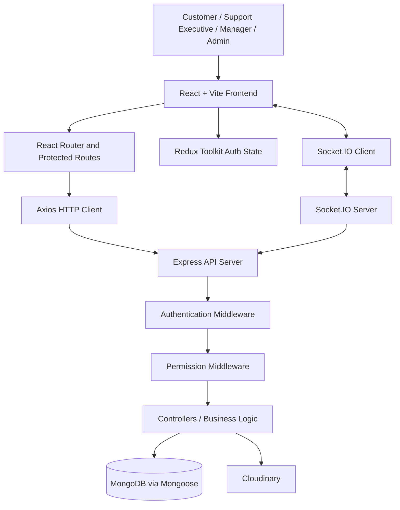
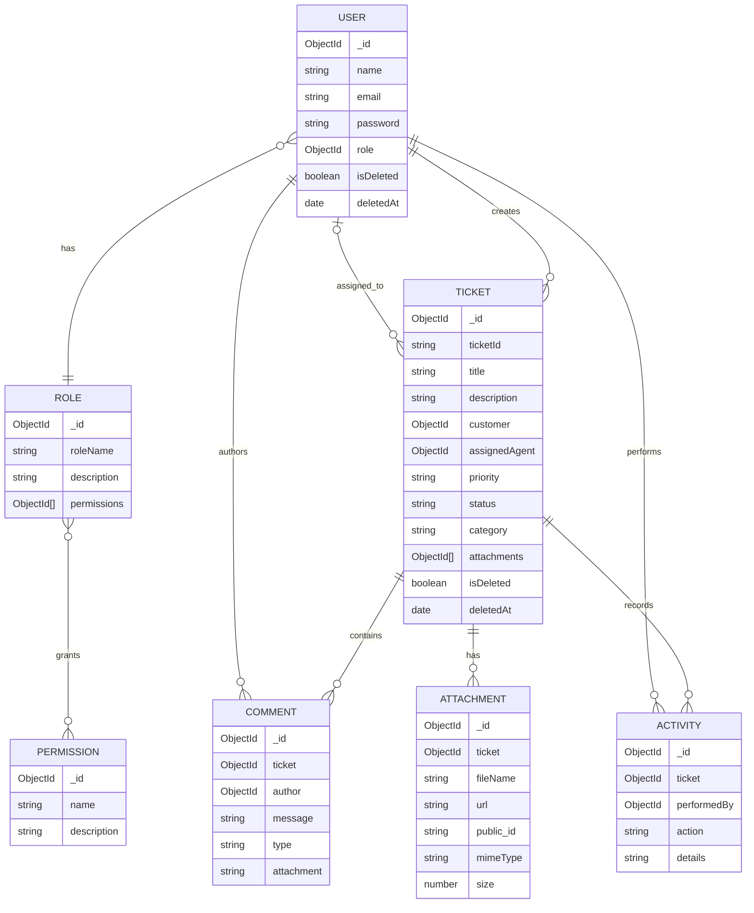

# Helpdesk Ticketing System

A full-stack helpdesk ticket management application built with **React, Node.js, Express, MongoDB, and Socket.IO**. It helps customers raise support tickets and allows support teams to manage, assign, track, and resolve them through a permission-controlled workflow.

## Contents

- [Overview](#overview)
- [Key Features](#key-features)
- [Technology Stack](#technology-stack)
- [System Architecture](#system-architecture)
- [Project Structure](#project-structure)
- [Application Workflow](#application-workflow)
- [Roles and Permissions](#roles-and-permissions)
- [Data Model](#data-model)
- [API Reference](#api-reference)
- [Environment Variables](#environment-variables)
- [Installation and Setup](#installation-and-setup)
- [Running the Application](#running-the-application)
- [Frontend Routes](#frontend-routes)
- [Real-Time Communication](#real-time-communication)
- [Security Notes](#security-notes)
- [Deployment](#deployment)
- [Troubleshooting](#troubleshooting)

## Overview

The Helpdesk Ticketing System centralizes customer support requests in one application. Customers can create tickets and follow their progress. Support executives can work on tickets assigned to them, communicate with customers, and add internal notes. Managers can oversee tickets and assign them to agents. Administrators can manage users, roles, and permissions.

The application uses a **dynamic role-based access control (RBAC)** model. Roles are stored in MongoDB and are associated with permission documents, rather than being limited to hard-coded role names.

## Key Features

### Ticket management
- Create tickets with a title, description, category, and priority.
- View tickets according to the current user's permissions and ticket relationship.
- Search, filter, sort, and paginate ticket lists.
- Update ticket details, status, and priority when authorized.
- Assign tickets to support agents.
- Soft-delete tickets using deletion fields rather than immediately removing the ticket record.
- View ticket details and activity history.

### Communication and attachments
- Add customer-visible comments to a ticket.
- Add internal notes for employee collaboration.
- Keep comments and internal notes as distinct communication types.
- Upload ticket attachments using Multer and Cloudinary.
- Use Socket.IO ticket rooms for real-time ticket-related communication.

### Dashboard
- View ticket summary counts.
- View ticket breakdowns by status, priority, and category.
- Review recent and unassigned tickets.
- View support-agent information when authorized.

### Administration
- Create, view, update, and delete users.
- Assign or change a user's role.
- Create, view, update, and delete roles.
- Create, view, update, and delete permissions.
- Control access to application features using permissions.

### User experience
- React-based responsive interface.
- Protected application routes.
- Redux Toolkit for authentication state.
- Toasts, loading states, empty states, and error states.
- Chart-based dashboard visualizations.

## Technology Stack

| Layer | Technologies |
|---|---|
| Frontend | React , Vite  |
| Styling | Tailwind CSS 4, DaisyUI 5 |
| Routing | React Router 7 |
| State management | Redux Toolkit, React Redux |
| HTTP client | Axios |
| Forms and validation | React Hook Form, Zod, Hook Form resolvers |
| Charts and icons | Recharts, Lucide React |
| Backend | Node.js, Express 5 |
| Database | MongoDB, Mongoose 9 |
| Authentication | JSON Web Token (JWT), bcrypt, cookie-parser |
| Authorization | Custom permission middleware (RBAC) |
| File uploads | Multer, Cloudinary |
| Real-time | Socket.IO and socket.io-client |
| Validation utilities | Validator |

## System Architecture

The application follows a **frontend–backend–database architecture**. The React client communicates with the Express API over HTTP. The backend authenticates requests, checks permissions, executes business logic, and reads or writes MongoDB documents through Mongoose. Socket.IO provides a separate real-time channel.



### Request lifecycle

1. A user interacts with a React page.
2. The page dispatches Redux actions where authentication state is involved, or calls the API through the shared Axios client.
3. Axios sends requests to the configured backend URL and includes credentials.
4. Express routes the request to the appropriate router.
5. Protected routes run authentication middleware to identify the current user.
6. Permission middleware checks whether the user has the required permission.
7. The controller validates and processes the request, then reads or updates MongoDB through Mongoose. File operations may use Cloudinary.
8. The API returns a JSON response to the frontend. For real-time updates, the Socket.IO channel can communicate with clients in ticket rooms.

### Architectural responsibilities

| Component | Responsibility |
|---|---|
| Pages | Route-level screens such as ticket list, details, dashboard, and administration |
| Components | Reusable UI elements and feature-specific presentation |
| Redux | Client-side authentication and permission state |
| Axios service | Shared HTTP configuration and credential handling |
| Express routers | API path definitions and middleware composition |
| Middleware | Authentication and permission enforcement |
| Controllers | Request handling and business logic |
| Mongoose models | MongoDB document schemas and references |
| Socket.IO | Real-time ticket-room communication |
| Cloudinary | Remote storage for uploaded files |

## Project Structure

```text
Ticket_Project/
├── Backend/
│   ├── src/
│   │   ├── config/
│   │   │   ├── cloudinary.js       # Cloudinary configuration
│   │   │   └── db.js               # MongoDB connection
│   │   ├── controllers/
│   │   │   ├── commentController.js
│   │   │   ├── dashboardController.js
│   │   │   ├── managementController.js
│   │   │   ├── ticketController.js
│   │   │   └── userAuthent.js
│   │   ├── middleware/
│   │   │   ├── permissionmiddleware.js
│   │   │   ├── upload.js
│   │   │   └── usermiddleware.js
│   │   ├── models/
│   │   │   ├── activity.js
│   │   │   ├── attachement.js
│   │   │   ├── comment.js
│   │   │   ├── counter.js
│   │   │   ├── permission.js
│   │   │   ├── role.js
│   │   │   ├── ticket.js
│   │   │   └── user.js
│   │   ├── routes/
│   │   │   ├── commentRouter.js
│   │   │   ├── dashboardRouter.js
│   │   │   ├── managementRouter.js
│   │   │   ├── ticketRouter.js
│   │   │   └── userAuth.js
│   │   ├── utils/
│   │   │   ├── generateTicketId.js
│   │   │   └── validator.js
│   │   ├── index.js                # Express and HTTP server entry
│   │   └── socket.js               # Socket.IO setup
│   ├── .env                        # Create locally; do not commit
│   └── package.json
│
└── Frontend/
    ├── public/
    ├── src/
    │   ├── Components/
    │   │   ├── admin/
    │   │   ├── dashboard/
    │   │   ├── homepage/
    │   │   ├── login/
    │   │   ├── signup/
    │   │   ├── TicketDetails/
    │   │   └── ticketsList/
    │   ├── hooks/
    │   │   └── usePermission.js
    │   ├── pages/
    │   │   ├── admin/
    │   │   ├── tickets/
    │   │   ├── DashboardLayout.jsx
    │   │   ├── homepage.jsx
    │   │   ├── login.jsx
    │   │   ├── signup.jsx
    │   │   └── Welcome.jsx
    │   ├── redux/
    │   │   ├── slices/authSlice.js
    │   │   └── store.js
    │   ├── services/
    │   │   ├── axios.js
    │   │   └── socket.js
    │   ├── App.jsx
    │   ├── index.css
    │   └── main.jsx
    ├── .env                        # Create locally; do not commit
    └── package.json
```

## Application Workflow

### 1. Authentication
- A user registers or logs in through the public authentication pages.
- The backend validates credentials and uses bcrypt for password hashing/comparison.
- The authenticated session is represented using a JWT stored in a cookie.
- The frontend can call the current-user endpoint to restore the signed-in user and permissions after a page refresh.
- Logout invalidates the current client session according to the backend authentication implementation.

### 2. Ticket lifecycle
1. An authorized customer creates a ticket.
2. The backend generates a unique ticket identifier and stores the ticket.
3. The ticket begins with the default `Open` status and `Medium` priority unless another value is supplied.
4. A manager or other authorized user can assign the ticket to an agent.
5. The assigned support executive reviews the ticket, updates its status or priority, and communicates through comments.
6. Employees with the relevant permission can add internal notes.
7. Ticket actions are recorded in the activity history.
8. Authorized users can resolve, close, or soft-delete tickets as supported by the application.

### 3. Ticket visibility
Ticket visibility is permission- and relationship-based. The API supports permissions for viewing all tickets, assigned tickets, or a user's own tickets. The backend is responsible for enforcing access; hiding a button in the frontend is not sufficient security.

### 4. Administration workflow
An administrator with the required permissions can create permission records, combine permissions into roles, and assign roles to users. This makes the access model configurable without hard-coding every role in the application.

## Roles and Permissions

Roles are configurable records. The following are example role profiles documented in the project; the actual permissions assigned in the database determine access.

| Example role | Typical access |
|---|---|
| Customer | Create tickets, view own tickets, add/view comments, view permitted activity |
| Support Executive | View assigned tickets, update status and priority, comment, add internal notes, view activity |
| Manager | View all tickets, assign tickets, update tickets, access dashboard, collaborate through comments and notes |
| Admin | Manage users and roles, and access ticket and dashboard functions according to assigned permissions |

### Permission groups

| Group | Example permissions |
|---|---|
| Tickets | `TICKET_CREATE`, `TICKET_VIEW_OWN`, `TICKET_VIEW_ASSIGNED`, `TICKET_VIEW_ALL`, `TICKET_UPDATE`, `TICKET_UPDATE_STATUS`, `TICKET_UPDATE_PRIORITY`, `TICKET_ASSIGN`, `TICKET_DELETE`, `TICKET_ATTACHMENT_CREATE`, `TICKET_RECEIVE_ASSIGNED` |
| Comments and notes | `COMMENT_CREATE`, `COMMENT_VIEW`, `INTERNAL_NOTE_CREATE`, `INTERNAL_NOTE_VIEW` |
| Activity | `ACTIVITY_VIEW` |
| Dashboard and agents | `DASHBOARD_VIEW`, `AGENT_VIEW` |
| Users | `USER_CREATE`, `USER_VIEW`, `USER_UPDATE`, `USER_DELETE` |
| Roles | `ROLE_CREATE`, `ROLE_VIEW`, `ROLE_UPDATE`, `ROLE_DELETE` |
| Permissions | `PERMISSION_CREATE`, `PERMISSION_VIEW`, `PERMISSION_UPDATE`, `PERMISSION_DELETE` |

Permission names are case-sensitive identifiers. Ensure the permission records assigned to roles match the identifiers checked by the backend routes and middleware.

## Data Model

The principal MongoDB collections are represented by Mongoose models.



### Model notes

- **User:** stores account information, a role reference, and soft-deletion fields.
- **Role:** stores a unique role name and references to permission documents.
- **Permission:** stores a unique permission name and description.
- **Ticket:** stores a unique ticket ID, title, description, customer, optional assigned agent, priority, status, category, attachment references, and soft-deletion fields. Mongoose timestamps are enabled.
- **Comment:** stores a message, author, ticket reference, optional attachment URL, and a type (`comment` or `internal_note`).
- **Activity:** stores the ticket, actor, action, and details for the audit timeline.
- **Attachment:** stores file metadata and the Cloudinary URL/public ID.

Ticket status values in the schema are `Open`, `In Progress`, `Waiting`, `Resolved`, and `Closed`. Priority values are `Low`, `Medium`, `High`, and `Critical`.

## API Reference

The backend mounts the following routers directly at the root paths shown below. Protected routes require a valid authenticated session and the permissions specified in the route configuration.

### Authentication — `/auth`

| Method | Endpoint | Purpose | Access |
|---|---|---|---|
| POST | `/auth/register` | Register a user | Public |
| POST | `/auth/login` | Log in | Public |
| GET | `/auth/me` | Get the current user | Authenticated |
| POST | `/auth/logout` | Log out | Authenticated |

### Tickets — `/tickets`

| Method | Endpoint | Purpose | Permission |
|---|---|---|---|
| POST | `/tickets` | Create a ticket | `TICKET_CREATE` |
| GET | `/tickets` | List tickets visible to the user | Any of `TICKET_VIEW_OWN`, `TICKET_VIEW_ALL`, `TICKET_VIEW_ASSIGNED` |
| GET | `/tickets/:ticketId` | Get ticket details | Any of the ticket-view permissions |
| PATCH | `/tickets/:ticketId` | Update ticket details | `TICKET_UPDATE` |
| PATCH | `/tickets/:ticketId/status` | Update status | `TICKET_UPDATE_STATUS` |
| PATCH | `/tickets/:ticketId/priority` | Update priority | `TICKET_UPDATE_PRIORITY` |
| POST | `/tickets/:ticketId/assign` | Assign a ticket | `TICKET_ASSIGN` |
| GET | `/tickets/:ticketId/activities` | Get ticket activity | `ACTIVITY_VIEW` |
| POST | `/tickets/:ticketId/attachments` | Upload an attachment (`image` multipart field) | `TICKET_ATTACHMENT_CREATE` |
| DELETE | `/tickets/:ticketId` | Soft-delete a ticket | `TICKET_DELETE` |

### Comments and internal notes — `/comments`

| Method | Endpoint | Purpose | Permission |
|---|---|---|---|
| POST | `/comments/:ticketId` | Add a customer-visible comment | `COMMENT_CREATE` |
| GET | `/comments/:ticketId` | List comments | `COMMENT_VIEW` |
| POST | `/comments/:ticketId/internal` | Add an internal note | `INTERNAL_NOTE_CREATE` |
| GET | `/comments/:ticketId/internal-notes` | List internal notes | `INTERNAL_NOTE_VIEW` |

### Dashboard — `/dashboard`

| Method | Endpoint | Purpose | Permission |
|---|---|---|---|
| GET | `/dashboard` | Dashboard summary | `DASHBOARD_VIEW` |
| GET | `/dashboard/tickets/status` | Ticket counts by status | `DASHBOARD_VIEW` |
| GET | `/dashboard/tickets/priority` | Ticket counts by priority | `DASHBOARD_VIEW` |
| GET | `/dashboard/tickets/category` | Ticket counts by category | `DASHBOARD_VIEW` |
| GET | `/dashboard/tickets/recent` | Recent tickets | `DASHBOARD_VIEW` |
| GET | `/dashboard/tickets/unassigned` | Unassigned tickets | `DASHBOARD_VIEW` |
| GET | `/dashboard/agents` | Support-agent information | `AGENT_VIEW` |

### Management — `/management`

| Method | Endpoint | Purpose | Permission |
|---|---|---|---|
| POST | `/management/permission` | Create a permission | `PERMISSION_CREATE` |
| GET | `/management/permissions` | List permissions | `PERMISSION_VIEW` |
| PATCH | `/management/permission/:id` | Update a permission | `PERMISSION_UPDATE` |
| DELETE | `/management/permission/:id` | Delete a permission | `PERMISSION_DELETE` |
| POST | `/management/roles` | Create a role | `ROLE_CREATE` |
| GET | `/management/roles` | List roles | `ROLE_VIEW` |
| PATCH | `/management/roles/:roleId` | Update a role | `ROLE_UPDATE` |
| DELETE | `/management/roles/:roleId` | Delete a role | `ROLE_DELETE` |
| POST | `/management/user` | Create a user | `USER_CREATE` |
| GET | `/management/users` | List users | `USER_VIEW` |
| PATCH | `/management/users/:userId/role` | Change a user's role | `USER_UPDATE` |
| DELETE | `/management/users/:userId` | Delete/deactivate a user | `USER_DELETE` |

> The route table documents paths and middleware permissions from the current source. Request bodies, query parameters, and exact response payloads should be checked in the corresponding controller before integrating a new client.

## Environment Variables

Create local `.env` files in both `Backend/` and `Frontend/`. Do not commit credentials or production secrets.

### Backend — `Backend/.env`

```env
PORT=5000
DB_CONNECT_STRING=mongodb+srv://<username>:<password>@<cluster>/<database>
JWT_SECRET=<long-random-secret>
CLOUDINARY_CLOUD_NAME=<cloud-name>
CLOUDINARY_API_KEY=<api-key>
CLOUDINARY_API_SECRET=<api-secret>
NODE_ENV=development
```

`DB_CONNECT_STRING`, Cloudinary variables, and `PORT` are read directly by the backend. `JWT_SECRET` is used by the authentication implementation; confirm the exact variable name in the authentication controller and keep it consistent.

### Frontend — `Frontend/.env`

```env
VITE_API_URL=http://localhost:5000
```

`VITE_API_URL` is used by Axios and the Socket.IO client. In this project the backend mounts routes at `/auth`, `/tickets`, `/comments`, `/dashboard`, and `/management` (not under an `/api` prefix), so the local base URL should point to the backend origin.

For a deployed frontend, set `VITE_API_URL` to the public backend origin. Rebuild the frontend after changing Vite environment variables.

## Installation and Setup

### Prerequisites

- Node.js (use a current LTS release compatible with the package versions)
- npm
- MongoDB database (local MongoDB or MongoDB Atlas)
- Cloudinary account for attachment uploads

### 1. Clone the repository

```bash
git clone <your-repository-url>
cd Ticket_Project
```

### 2. Configure the backend

```bash
cd Backend
npm install
```

Create `Backend/.env` and set the required database, authentication, Cloudinary, and port values.

### 3. Configure the frontend

Open another terminal:

```bash
cd Frontend
npm install
```

Create `Frontend/.env` and set `VITE_API_URL` to the backend origin.

## Running the Application

Start the backend:

```bash
cd Backend
npm run dev
```

The backend connects to MongoDB before starting the HTTP server. The default example configuration uses port `5000`; the actual port is controlled by `PORT`.

Start the frontend in a separate terminal:

```bash
cd Frontend
npm run dev
```

Vite typically serves the frontend at `http://localhost:5173`. Open the URL printed in the terminal.

### Available scripts

**Backend**

| Command | Description |
|---|---|
| `npm run dev` | Start the backend with Nodemon |
| `npm start` | Start the backend with Node.js |

**Frontend**

| Command | Description |
|---|---|
| `npm run dev` | Start Vite development server |
| `npm run build` | Create a production build |
| `npm run preview` | Preview the production build locally |
| `npm run lint` | Run ESLint |

## Frontend Routes

| Route | Page | Access |
|---|---|---|
| `/` | Homepage | Public |
| `/login` | Login | Public |
| `/signup` | Signup | Public |
| `/welcome` | Protected application shell; redirects to dashboard | Authenticated |
| `/welcome/dashboard` | Dashboard | `DASHBOARD_VIEW` |
| `/welcome/tickets` | Ticket list | Any ticket-view permission |
| `/welcome/tickets/create` | Create ticket | `TICKET_CREATE` |
| `/welcome/tickets/:ticketId` | Ticket details | Any ticket-view permission |
| `/welcome/tickets/:ticketId/edit` | Edit ticket | `TICKET_UPDATE` |
| `/welcome/tickets/:ticketId/assign` | Assign ticket | `TICKET_ASSIGN` |
| `/welcome/admin/users` | User management | `USER_VIEW` |
| `/welcome/admin/roles` | Role management | `ROLE_VIEW` |
| `/welcome/admin/permissions` | Permission management | `PERMISSION_VIEW` |

## Real-Time Communication

The backend creates an HTTP server and attaches Socket.IO to it. The frontend creates a Socket.IO client using `VITE_API_URL`.

The server defines ticket rooms and internal-note rooms:

| Event | Direction | Purpose |
|---|---|---|
| `joinTicket` | Client → server | Join `ticket:<ticketId>` |
| `leaveTicket` | Client → server | Leave `ticket:<ticketId>` |
| `joinInternalTicket` | Client → server | Join `ticket:<ticketId>:internal` |
| `leaveInternalTicket` | Client → server | Leave `ticket:<ticketId>:internal` |

Room membership supports scoped real-time communication. **Important:** Socket.IO room joining in the current implementation is based on client-supplied ticket IDs. Before exposing this to untrusted production clients, validate the user's authentication and ticket permissions on socket connections and room-join events. Room names alone are not an authorization boundary.

## Security Notes

- Keep `.env` files out of version control. Rotate any credentials that have been exposed.
- Use HTTPS in production and configure secure, HTTP-only cookies with appropriate `SameSite` settings.
- Configure CORS with only the required frontend origins.
- Enforce authorization in backend middleware and controllers; frontend route guards are for user experience, not the security boundary.
- Ensure internal notes are never returned by customer-facing comment endpoints.
- Validate and limit uploaded file types and sizes; do not trust client-provided MIME types alone.
- Validate ticket ownership/assignment and permission scope on every ticket read or mutation.
- Use a strong, randomly generated JWT secret and apply appropriate token expiry and revocation policies.
- Apply rate limiting and request validation to public authentication endpoints before production use.
- Review soft-delete behavior to ensure deleted users and tickets are excluded consistently from queries.

## Deployment

The frontend can be built and hosted on a static hosting provider such as Vercel. The backend must run on a Node.js hosting service that supports persistent HTTP connections and WebSocket/Socket.IO traffic.

### Frontend deployment
1. Set `VITE_API_URL` in the hosting provider's environment settings to the deployed backend origin.
2. Build using `npm run build`.
3. Configure the hosting provider to serve the Vite build output (`dist`).
4. Configure SPA rewrites so nested React Router routes resolve to `index.html`.

### Backend deployment
1. Set all backend environment variables in the hosting provider.
2. Ensure the MongoDB deployment allows connections from the backend host.
3. Add the deployed frontend origin to both Express CORS and Socket.IO CORS configuration.
4. Deploy the backend using `npm start`.
5. Confirm the host supports WebSocket connections and persistent Socket.IO traffic.

The source currently includes `https://helpdesk-ticketing-frontend.vercel.app` as a permitted frontend origin. Update the CORS allowlist if the frontend domain changes.

## Troubleshooting

| Issue | Checks |
|---|---|
| Backend does not start | Verify `PORT`, MongoDB connection string, network access, and server logs. |
| MongoDB connection fails | Check Atlas IP access rules, credentials, database name, and URI encoding. |
| Login or `/auth/me` fails | Check cookie settings, `withCredentials`, CORS origins, JWT configuration, and browser cookie restrictions. |
| Frontend cannot reach backend | Confirm `VITE_API_URL` is the backend origin and restart Vite after changing `.env`. |
| Socket.IO connection fails | Check the backend URL, CORS origins, hosting WebSocket support, and server logs. |
| Attachment upload fails | Verify Cloudinary credentials, upload field name (`image` for ticket attachments), file limits, and network access. |
| Access denied | Verify that the user's role references the required permission documents and that permission names match exactly. |
| A route returns 404 | Confirm the route prefix and path; the backend does not mount an `/api` prefix in the current source. |

## Contributing

1. Create a feature branch.
2. Keep changes scoped and follow the existing folder organization.
3. Run the frontend lint command and production build before submitting.
4. Test authorization-sensitive changes with users having different permissions.
5. Never commit secrets, generated build output, or `node_modules`.

